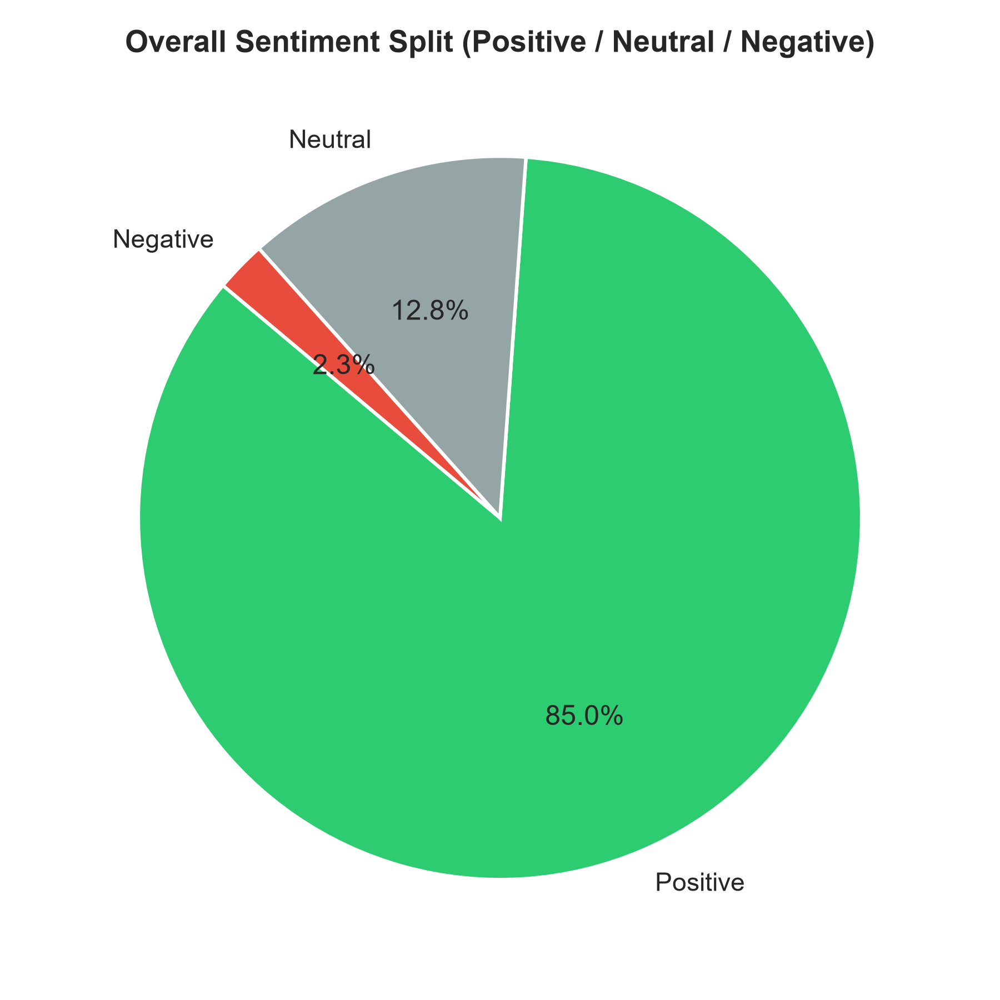
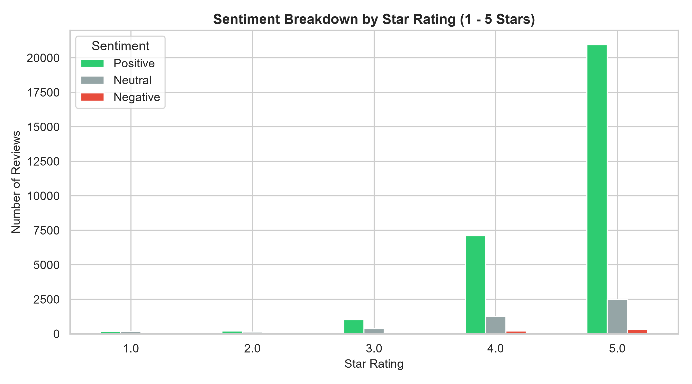
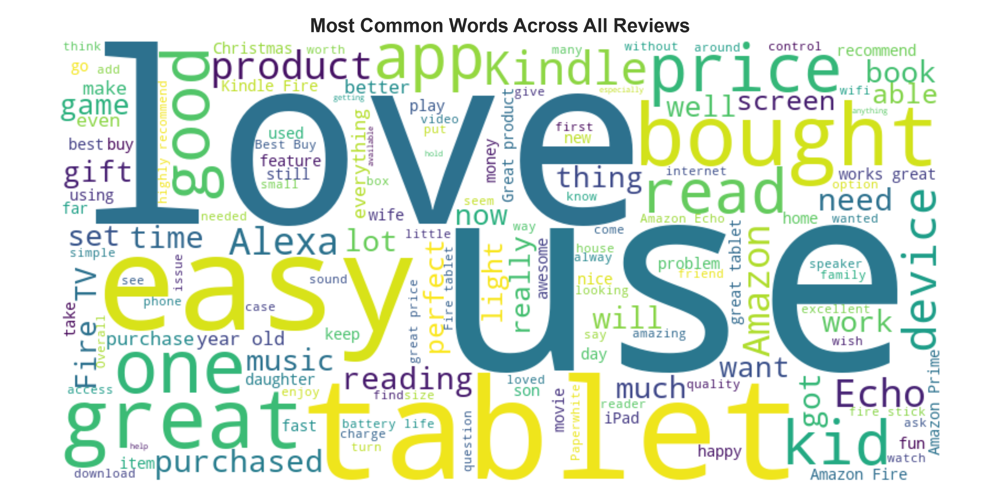
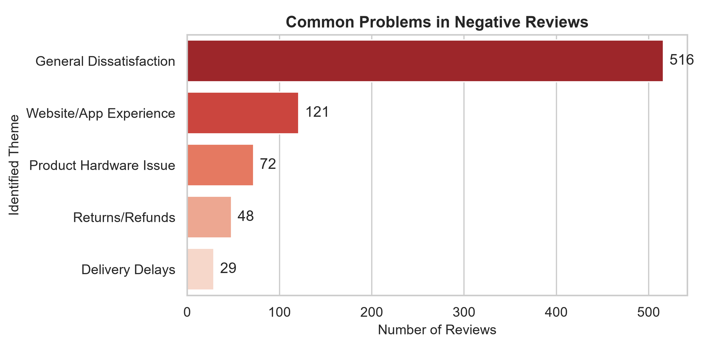
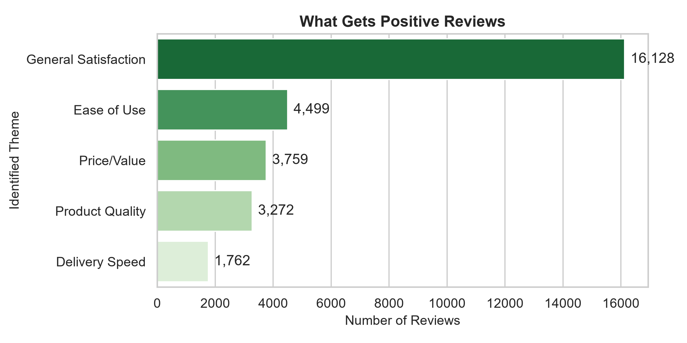

# 404-Amazon-sentiment-analysis

## 📌 Project Overview
This project is developed as part of the CAPACITI AI Bootcamp (Week 3: Sentiment Analysis & Data Insights). The objective is to ingest a large-scale consumer review dataset of Amazon products, execute automated text cleaning and lexicon-based sentiment classification using Python, and present the findings through an analytical dashboard report.

---

## 📂 Dataset Description
* **Source:** Amazon Product Reviews Dataset (`1429_1.csv`)
* **Total Records Analyzed:** 34,660 consumer reviews spanning Amazon hardware (Fire Tablets, Kindle, Echo, and Fire TV).
* **Key Attributes:** Star ratings (`reviews.rating`), review text (`reviews.text`), and product identifiers (`name`).

---

## 🛠️ Technical Stack & Libraries
* **Language:** Python
* **Data Processing:** Pandas, NumPy
* **Sentiment Analysis:** TextBlob (Polarity calculation)
* **Visualizations & Dashboards:** Matplotlib, Seaborn, WordCloud

---

## 📊 Summary Metrics
* **Total Reviews Analyzed:** 34,660
* **Average Product Rating:** 4.58 / 5.0
* **Positive Sentiment Share:** ~85.0%
* **Negative Sentiment Share:** ~2.3%

---

## 📈 Dashboard Visualizations

### 1. Overall Sentiment Split
The distribution of sentiment across all categories evaluated via polarity scoring:


### 2. Sentiment Breakdown by Star Rating
Mapping predicted sentiments across the 1-to-5 star rating scale:


### 3. Word Cloud Insights
Most prominent terms appearing across all customer feedback:


### 4. Theme Extraction (Negative vs. Positive Drivers)
* **Common Problems in Negative Reviews:** Identifying top friction points like product hardware issues and delivery delays.
  

* **What Gets Positive Reviews:** Highlighting key drivers of customer satisfaction such as product quality and price value.
  

---

## 🚀 How to Run the Script Locally

1. **Clone the repository:**
   ```bash
   git clone [https://github.com/PamMasina/404-Amazon-sentiment-analysis.git](https://github.com/PamMasina/404-Amazon-sentiment-analysis.git)
   cd 404-Amazon-sentiment-analysis